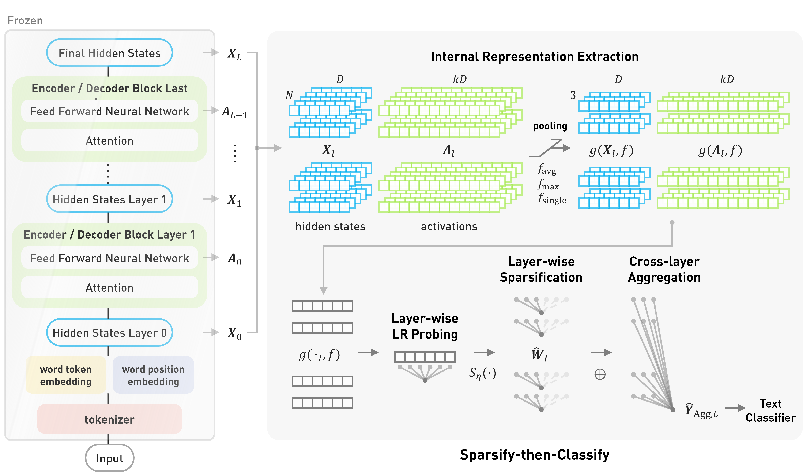

# Sparsify-then-Classify
Code repository for the paper ***Sparsify-then-Classify*** **: Towards Next-Generation Text Classifier Leveraging Internal Neuron Representations from Large Language Models** by Yilun Liu, Difan Jiao and Ashton Anderson.

This repository contains all experimental infrastructure for the paper. 

## Methodology

### Internal Representation Extraction
### 
###
###
## Experiments

## 1
