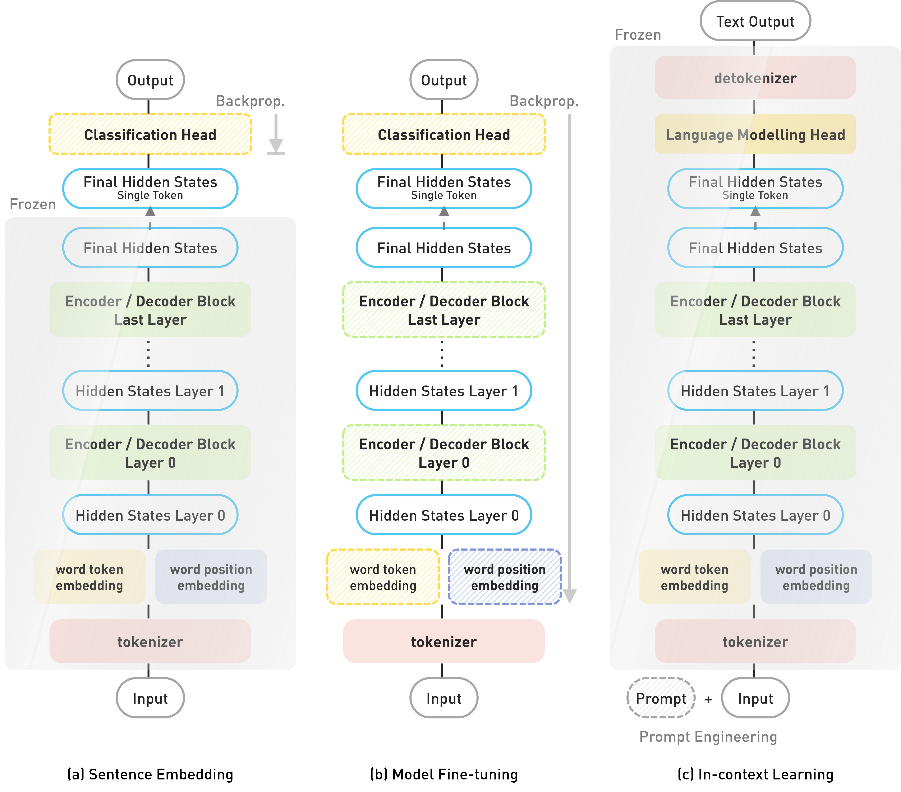

# Sparsify-then-Classify
Code repository for the paper ***Sparsify-then-Classify*** **: Towards Next-Generation Text Classifier Leveraging Internal Neuron Representations from Large Language Models** by Yilun Liu, Difan Jiao, and Ashton Anderson.

This repository contains all experimental infrastructure for the paper. 

## Methodology

Our proposed STC method, as a seamless plug-and-play module on top of existing LLMs, follows a procedure of
1. Internal Representation Extraction
     + We investigate the FFN activations and hidden states for all layers. The internal representations are all pooled across tokens (max pooling, average pooling, and single-token pooling) for each sentence input in batches.
2. Layer-wise LR Probing
    + For each layer of pooled internal representations, we train logistic regressors (LR) with $\mathcal{L}^1$-regularization as linear classification probes.
3. Layer-wise Sparsification
    + For the trained LR probes, we consider input neurons that are attributed with larger weights as more important ones. Hence by pruning the least important features, we can effectively filter out neurons with less task-specific features for each layer independently. This is implemented by sorting and calculating the cumulative sum of importance (defined by the squared weights) until a certain threshold $\eta ||\mathbf{\mathit{W}}||_2^2$ is reached.   
4. Cross-layer Aggregation
    + The aforementioned layer-wise task-specific neurons are concatenated together across layers, and we train another LR classifier on top of the aggregated features.

## Experiments
Our experiments demonstrate that STC not only consistently improves the classification performance of pretrained and fine-tuned models, but is also more efficient for both training and inference, and is more intrinsically interpretable.
+ The IMDb, GLUE SST-2, and EDOS datasets are used in our experiments.
+ 6 well-established transformer-based language models: RoBERTa, DistilBERT, and GPT2 family including GPT2, GPT2-M, GPT2-L and GPT2-XL, are tested.
+ The performance of STC is reported when integrated into frozen pretrained and task-specific fine-tuned models, as well as 3 conventional baselines: sentence embedding, model fine-tuning, and in-context learning.




## Citation
If you find our code or datasets useful in your research, we would appreciate it if you could cite our paper
```TeX
@article{YourPaper2023,
  title={Your Paper Title},
  author={Your Name and Co-Authors},
  journal={Journal Name},
  volume={xx},
  number={xx},
  pages={xx--xx},
  year={2023},
  publisher={Publisher}
}
```

